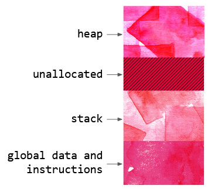

## .allocate()

# 🔬

This graphic represents a simplified model of how memory is allocated when a computer program is run. All of the instructions and the variables to be computed are contained within such a memory block. 

​                          

There are four broad types of memory within a program: global data & instructions (the template for the program’s execution and data which lives throughout the program’s life), stack and heap (different styles of memory which have their pros and cons for size and speed) and unallocated portion, which may be claimed by the stack or the heap. In this case, we can visualize the heap growing downwards, and the stack growing upwards into the unallocated space.

When performing computations with large amounts of data, it is generally more efficient to reserve a big block of memory which you anticipate you will need, rather than nibbling off smaller chunks at a time. However if you are too greedy you risk running out of memory, causing the program to crash.

# 🧩

This card is akin to staking out a plot of land to build a house on: a necessary and bold first step to realizing a longer-term vision. If you are building a house, you don’t acquire the land one room at a time, you buy what the final footprint demands. Taking it back to the memory analogy, we allocate memory in anticipation of what we will do with it rather than the immediate demands.

To realize a bold vision means taking up space than you may have been accustomed to, but also moderating this to prevent you from exhausting the available capacity. More memory is always available to add on!

# 🖋️

- What are symbolic and practical steps you can make right now to take up more space for a big vision?
- Are you more effective when you set an ambitious goal at the outset that may seem impossible or when you tend to move closer to your comfort zone?

# 📚

Learn about [Stack and Heap](https://icarus.cs.weber.edu/~dab/cs1410/textbook/4.Pointers/memory.html) memory.