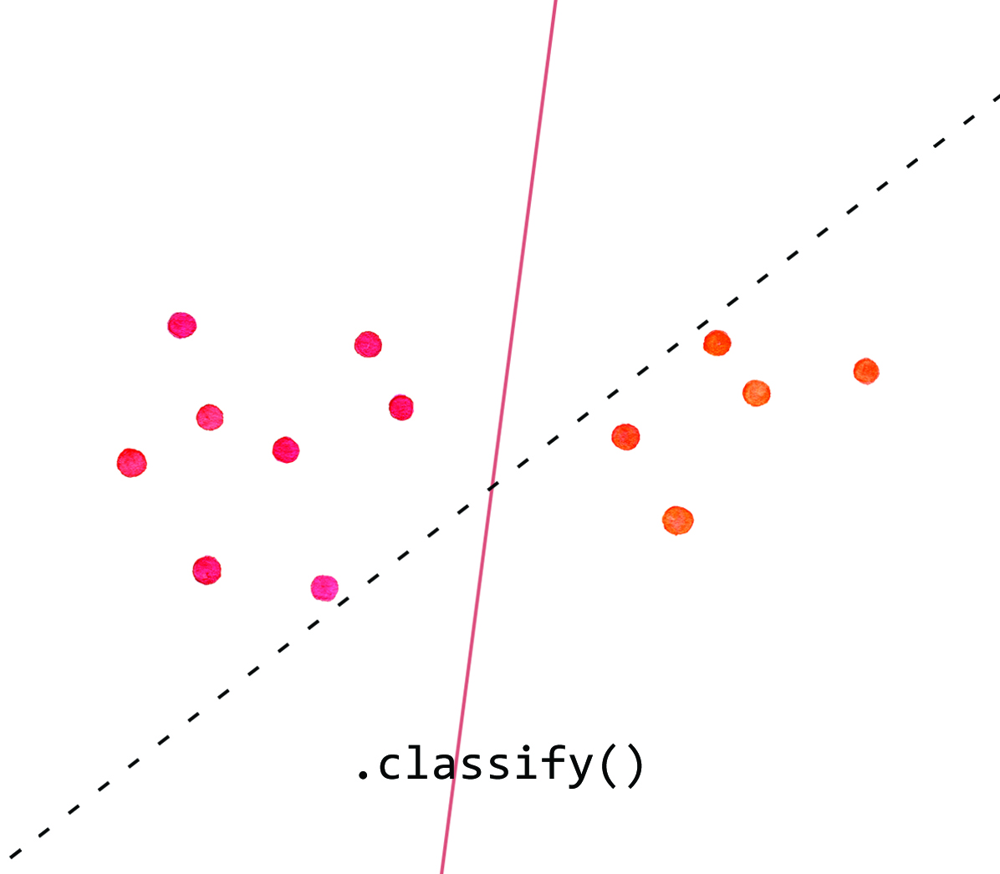
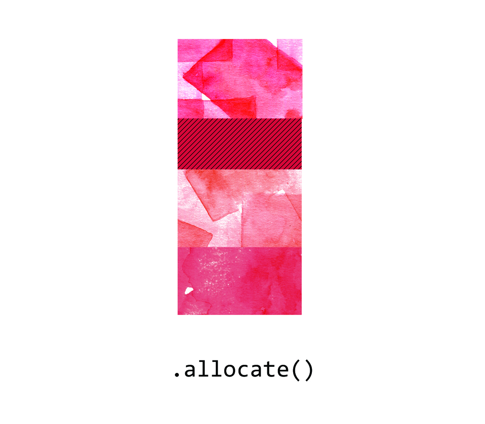
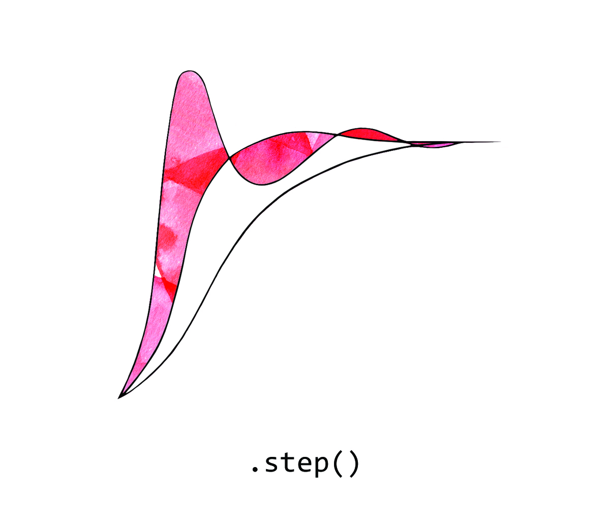

### Assert

When we’re testing or running code, we can add an *assert* statement which only allows the program to continue if the included condition is met. This class represents states of being which are unequivocal, immediate and powerful.

Return [home](../index.md).
