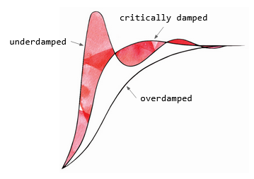

## .step()

# 🔬

A step function as depicted on this card is a tool for understanding the behavior of a dynamic system (one which changes its state over time) subject to an external force. We see three types of response: underdamped, critically damped and overdamped, ranging from most to least oscillatory. 

​                          

While the underdamped case is fast, it is rather unstable. At the other extreme, the overdamped case is simply too slow. The ‘Goldilocks’ response, known as critically damped, has a mix of speed and precision.

# 🧩

Whether we seek change or have it brought to us, it can be represented as a step function - an immediate transition from one state to another. Taking inspiration from the three curves, we may respond in a jumpy, unstable way, an unduly sluggish way, or somewhere in between. 

# 🖋️

- Think of a recent major shift in your life. Which of these three curves best depicts your response? What were the pros and cons of this response? What would the alternative have looked and felt like?

# 📚

[Watch](https://www.youtube.com/watch?v=fusr9eTceEo) a video showing different step response behaviors for different sets of input parameters.