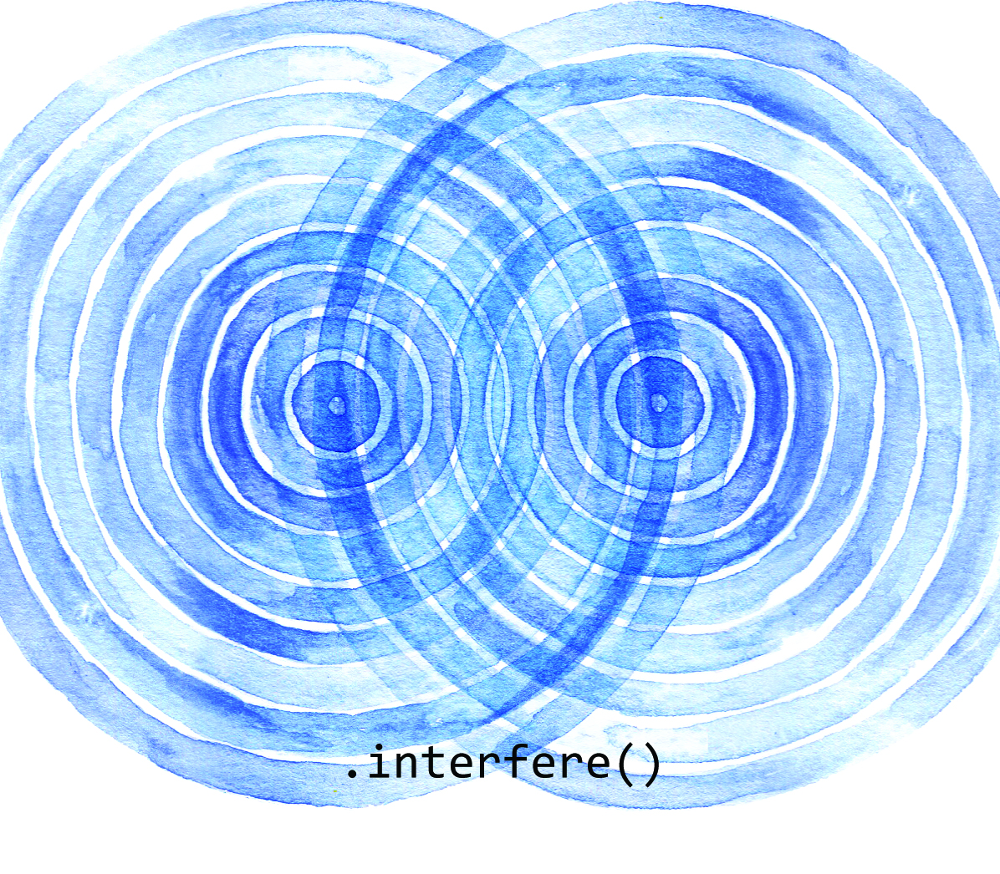
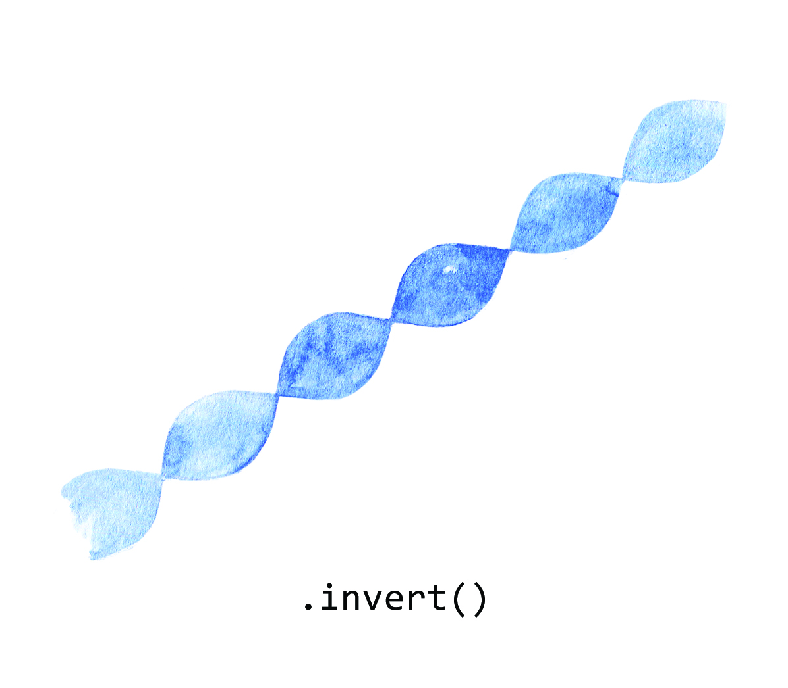
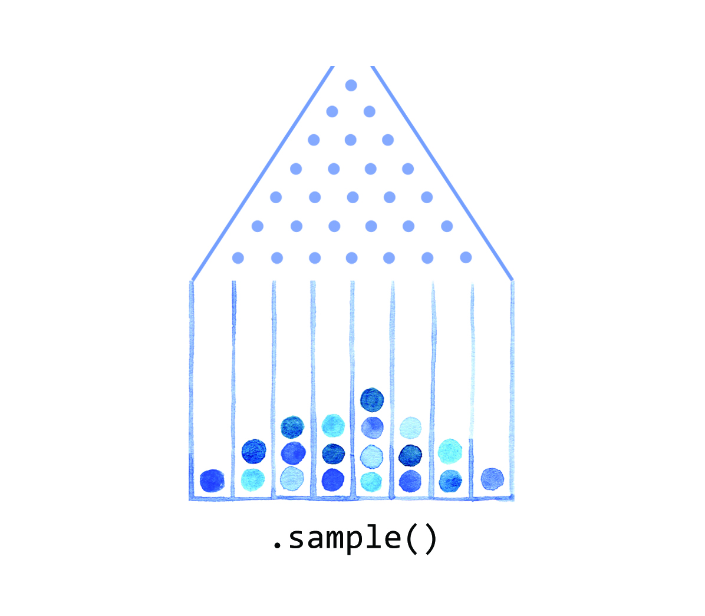
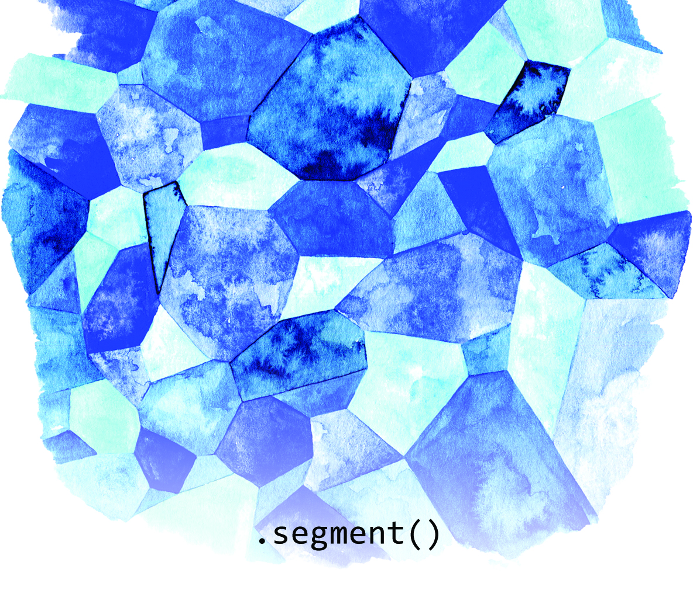
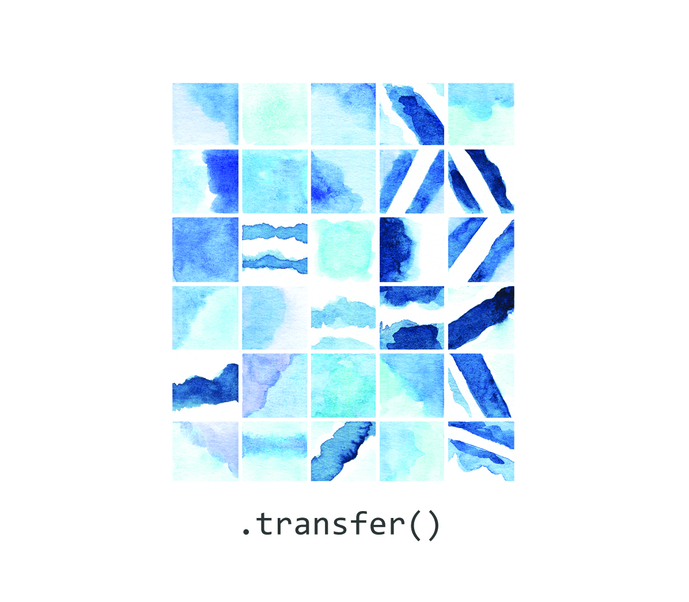

#### Branch

In a series of *if statements*, which allow code to run if certain conditions are met, each of these options is known as a branch. This class represents the practice of considering alternatives and how they relate to each other.

