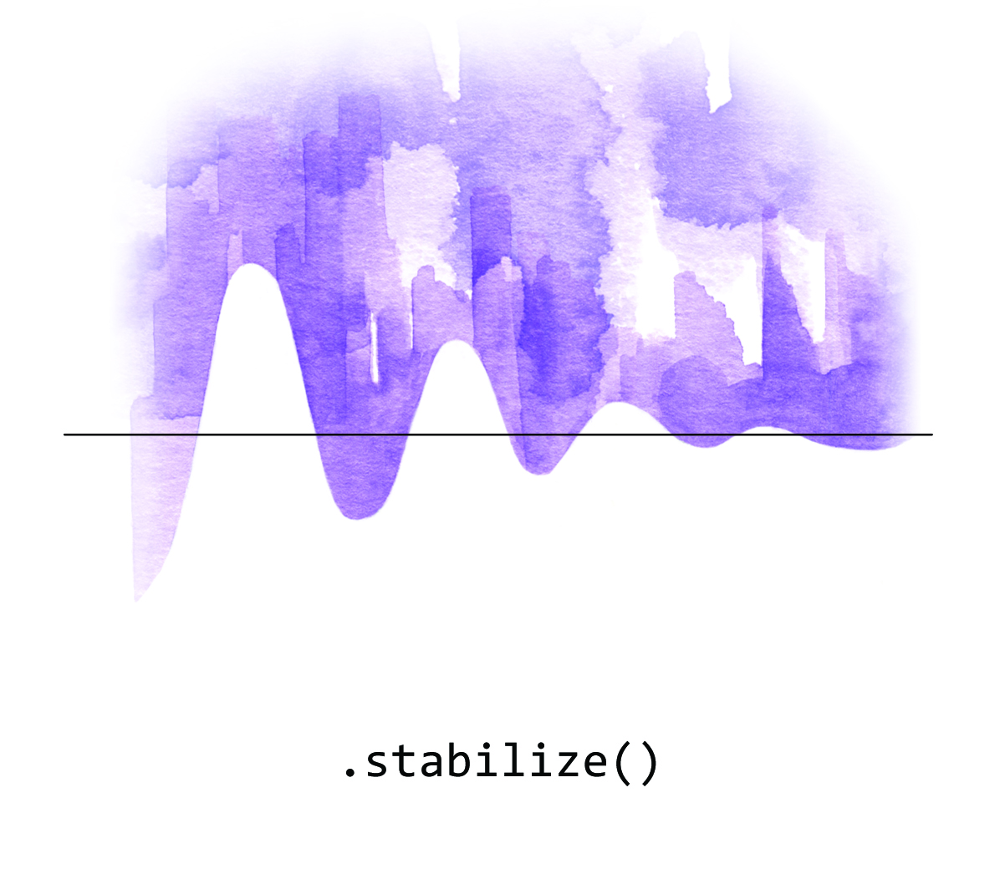
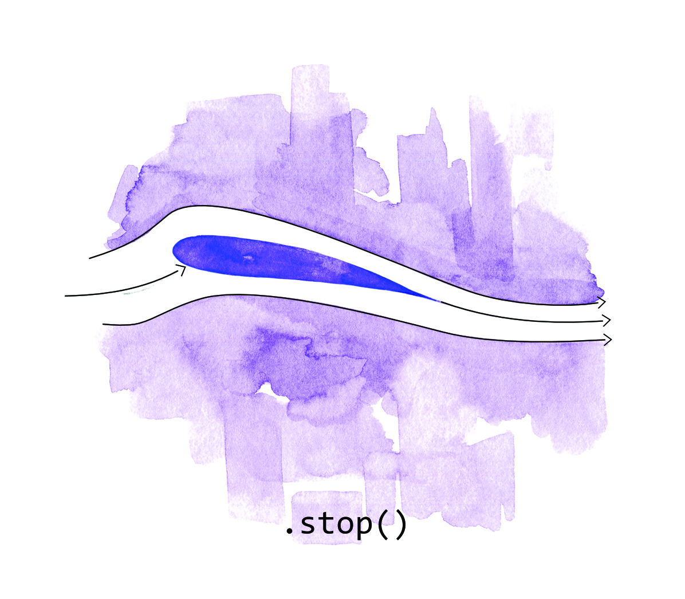
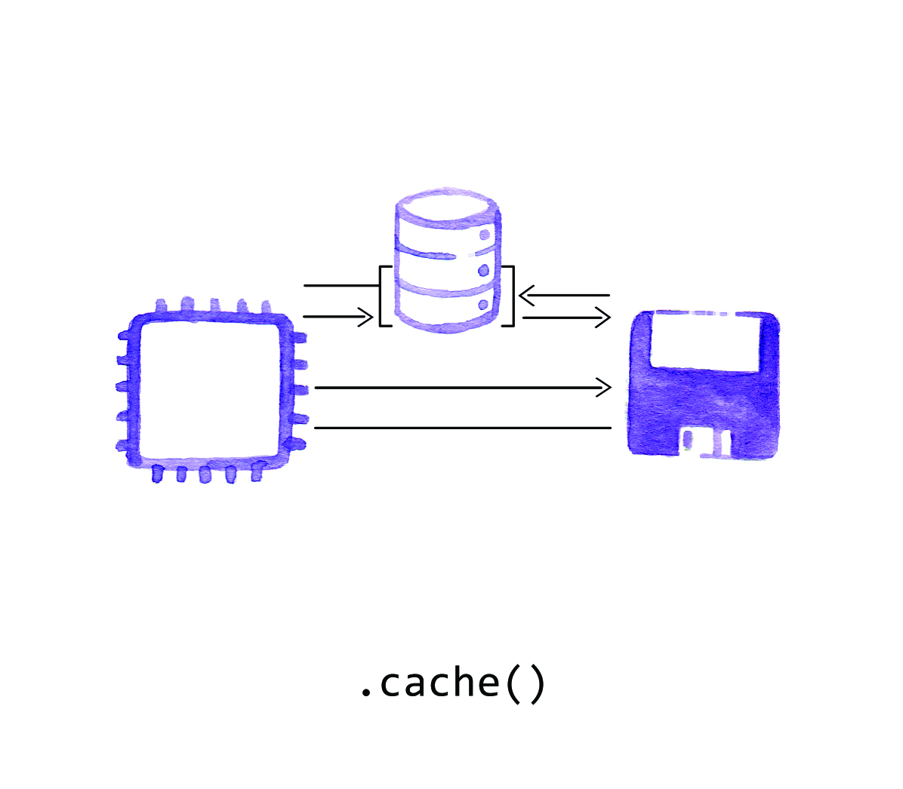
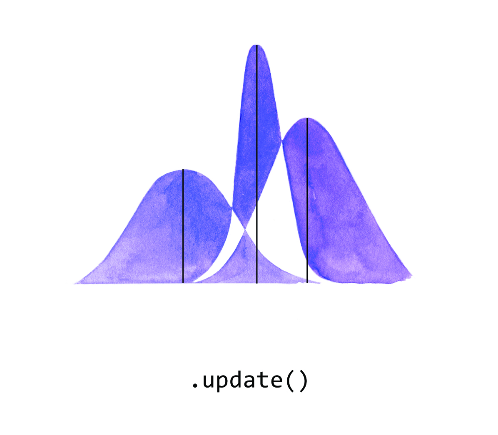
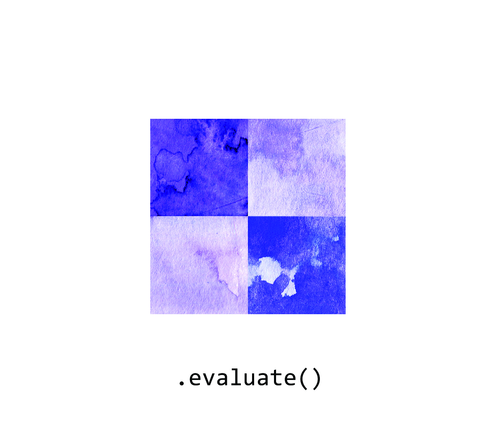

### Debug

The use of the term debugging to mean finding the cause of a malfunctioning program arose from the case of finding a moth in an early mainframe computer. This class focuses on concepts of self-reflection.

Return [home](../index.md).