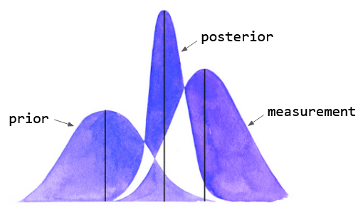

## .update()

# 🔬

This graph is a visualization of the signal processing algorithm known as Kalman Filter, which is used in applications as diverse as aerospace, economics and robotics. It presents a way of estimating the state of an object (for example, the location of an object being tracked by radar) when you have knowledge of its dynamics (the rules for its motion) and measurements from sensors. The filter is able to produce an estimate which takes into account how much uncertainty you have about each source of information, to give you an optimal estimate of the object’s state.

​                          

In this example, we see three bell curves, each with a mean (its peak) and a distribution (how wide it is). If a curve is wide then we are quite uncertain about the true value; on the other hand, if it is narrow, we have higher confidence in the true value. The left hand curve is called a prior, and is the initial guess of the object’s state. We receive a measurement from a sensor, represented by the right hand curve, which estimates the state quite differently from the first. We are then able to combine our initial guess with the measurement to produce what we call a posterior, whose mean is based on the distribution of the input data, and which has a higher confidence than either of the input data!

# 🧩

This is an extremely powerful concept which encapsulates a perennial dilemma: as you construct a model of the world, how much should you rely on your own experience or what you have been told (through either explicit instruction or subconscious beliefs) versus newly received information? 

This is a compact representation of what it means to be open- versus closed-minded. To be open-minded is to accept that one’s beliefs are uncertain. Let’s assume for a moment that the value of the measurement is actually the true state (generally not true, but let’s pretend). In this case, an open-minded person will have their internal model of the world updated to be closer to the true state, whereas for the closed-minded person, it would barely budge. 

# 🖋️

- What are your most tightly-held beliefs? What would happen if you were to relax how certain you were about them?
- When have you been most effective in encouraging someone else to change their mind?

# 📚

[Learn](https://www.youtube.com/watch?v=mwn8xhgNpFY) more about Kalman Filters.

Return [home](../index.md).
