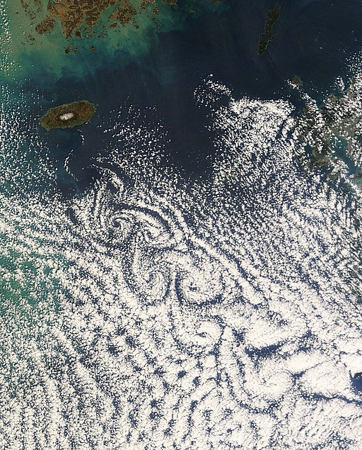

## .circulate()

# 🔬

The flow pattern here is known as a Karman Vortex Street, and captures the dynamics of turbulence from an obstruction to a fluid flow from left to right. The phenomenon is visible at macro and micro scales alike, from cloud patterns on the downwind side of islands in the ocean, to smoke trails around an obstacle in a lab environment.

​                          

Karman Vortex Street cloud pattern off South Korea ([source](https://commons.wikimedia.org/wiki/File:Jeju_Do_Von_Karman_Vortex_street_Mar_2_2011_02.35(UTC).jpg))

The most striking feature here is the ‘exchange’ of flow between top and bottom tendrils, each helping the other to grow bigger.

# 🧩

On the level of an individual tendril, it appears to be spiraling in an unstable manner. Viewed at a larger scale, it is part of a gentle growth of swirls that is ‘supported’ by the surrounding atmosphere. If you imagine a life’s progression as moving from left to right, a small initial disruption causes a deviation in one direction, followed by a change in course, and a completion of one chapter. The next chapter emerges from this unexpected place, and so on. Meanwhile, the inertia of the surrounding atmosphere bounds how far you can wander. Even when it feels like there is no outside support, there very well is. At each turn, it might feel like you are spiraling out of control, but viewed in retrospect, a distinct and beautiful pattern emerges. 

# 🖋️

- Consider decisions which seemed irresponsible at the time or circumstances which were unplanned. What knock-on effects did these provoke? How can this change your attitude towards unexpected or seemingly undesirable situations?
- What are some examples of external resources which you may have forgotten you have access to?

# 📚

[Watch](https://www.youtube.com/watch?v=k9FPxuhFlTo) a Karman Vortex Street developing in real-time.

Return [home](../index.md).
