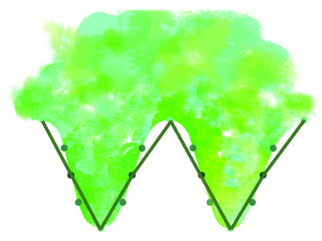

## .interpolate()

# 🔬

Phenomena in the natural world which we wish to measure are commonly *continuous*, which means that they do not jump from one value to another, but rather smoothly move between them. Unfortunately, instruments that we use to measure such signals can only capture data at discrete intervals. Still, we are interested in the underlying phenomena, and we can approximate it by applying a technique known as interpolation. This is a cousin of *extrapolation*, which tends to be used when making a prediction in the future.

In this card, we see the true underlying phenomena we wish to discover (in this case, a sine wave), and points at which we have captured measurements. To illustrate this example, we use points with three colors. 

If we only use the dark points and draw lines between them from left to right, all we will be left with is a horizontal line, which is a pretty far cry from the wave. 

​                          

If we add the medium points to the mix, and draw lines from left to right including both the solid and shaded points, you will see that the peaks and valleys start to emerge. This is a better approximation, but still not very expressive. 

​                             

Finally, if we include the light points, a curvature starts to emerge which looks much more wave-like. 

​                             

# 🧩

Like the example presented in the card, we rarely have enough information to fully understand something. We must therefore ask ourselves how reliable our reconstruction of the phenomenon is based on the information at hand. Unfortunately, it is not always obvious how much information we need to gather before being confident that we understand what our data points collectively represent. Too little data, and the conclusions we draw are wildly far from the truth. Too much data, and we have wasted effort as we could have reached the same conclusion more efficiently. 

# 🖋️

- What is an example of a situation where you had to ‘join the dots’ from the limited evidence you had available to you, in order to resolve it?