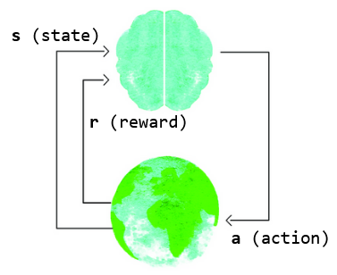

## .learn()

# 🔬

This card captures the essence of what it is to move through the world as a conscious being. This model is the basis for the branch of machine learning known as reinforcement learning, and crosses over into behavioral psychology and cognitive science too. 

​                          

In this model, an agent performs actions **a** in an environment, and receives feedback in the form of a changed environment (state, **s**) and rewards **r**, which may be positive or negative. 

# 🧩

We have got to where we are as humans by following this model, and at many timescales simultaneously. The key insight here is that the reward is no more than an objective signal about the outcome of your interaction with something; we may respond anywhere on the emotional spectrum but that is largely a conditioned response to the original stimulus, and is one of many options. 

# 🖋️

- What is a lesson you recently learned the ‘hard way’? If there was a strong emotional charge around it, what effect did this have on your recovery? What is a way you might have reframed what you learned in a more constructive light?
- What is your attitude towards experimentation to rapidly discover what works and what doesn’t?

# 📚

[Learn](https://www.youtube.com/watch?v=e3Jy2vShroE) more about Reinforcement Learning.

Return [home](../index.md).
