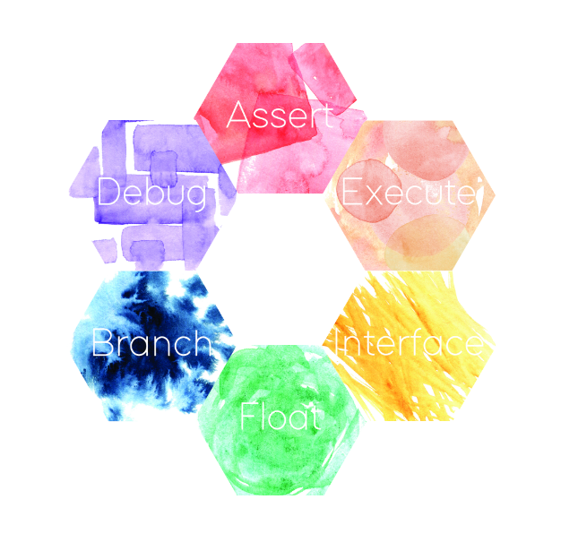
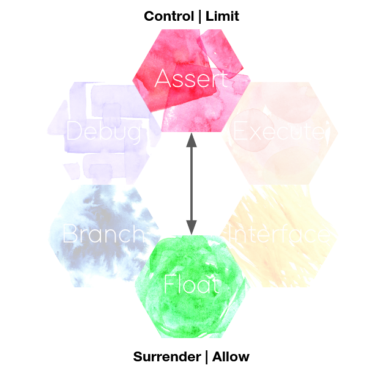
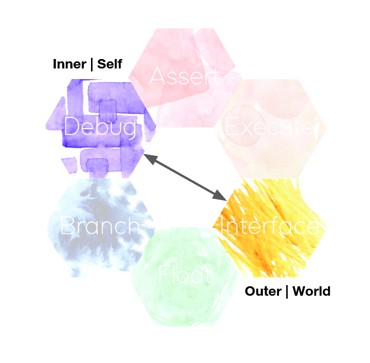
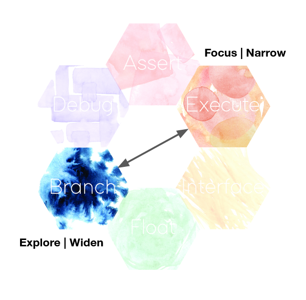

## Structure and Layout

The color cards in this deck are grouped into six *classes*, each named with a term from computer science, which loosely describes the qualities of their respective cards.

Within these classes are three axes, whose cards lie opposite each other and whose colors and themes are complementary. The three axes here are similar in intent to the categories found in frameworks such as the Myers-Briggs Type Indicator. As opposed to fixed personality traits, these axes instead present a range of ways of *being*. These are states that we can ideally access at any time, and which we can move fluidly between. It is most effective to strike a balance between each, and not get trapped at an extreme. For each pair, there are some terms which give some more depth to that edge of the polarity.

​                  

​                         

​              

Here’s a brief description of why each class has been named as such.

#### Assert

When we’re testing or running code, we can add an *assert* statement which only allows the program to continue if the included condition is met. This class represents states of being which are unequivocal, immediate and powerful.

#### Float

A *floating-point number* is a way of representing a number that is not an integer (a whole number). This class represents unstructured, divergent thinking.

#### Execute

To execute a program is to run it. This class brings together concepts of getting the job done with clarity and ease, even in the midst of real-world ambiguity. 

#### Branch

In a series of *if statements*, which allow code to run if certain conditions are met, each of these options is known as a branch. This class represents the practice of considering alternatives and how they relate to each other.

#### Interface

In computer science and engineering, an interface defines the connection between otherwise isolated components, such as a USB device to a computer. This class presents concepts of relationship with others where we may not know what is going on inside them.

#### Debug

The use of the term debugging to mean finding the cause of a malfunctioning program arose from the case of finding a moth in an early mainframe computer. This class focuses on concepts of self-reflection.